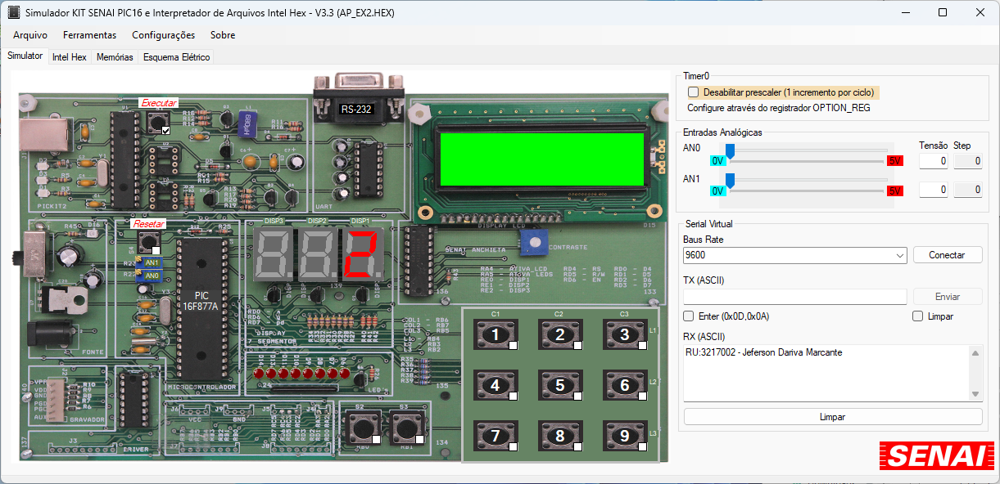
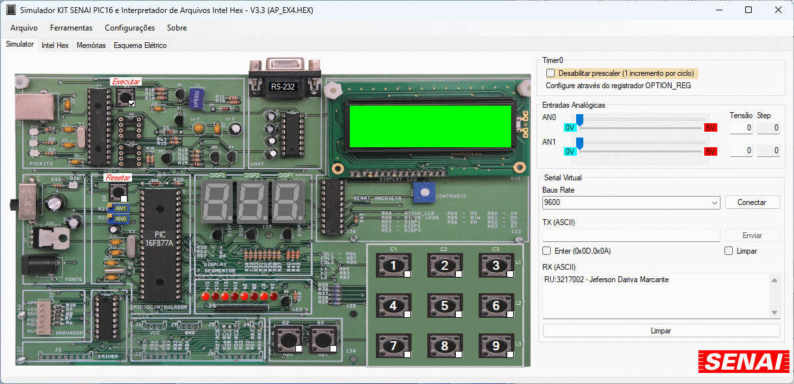

## Projetos com o microcontrolador PIC16F877

Projetos concebidos para a disciplina de Microcontroladores e Microprocessadores do curso de Engenharia de Computação da UNINTER. O intuito desta atividade é proporcionar aos alunos a oportunidade de aplicar, de forma prática, os conhecimentos teóricos adquiridos ao longo do curso.

Para a realização dessa tarefa, foram utilizados o simulador KIT SENAI PIC16, desenvolvido pelo SENAI, e o software MPLab, criado pela Microchip. Os links para download estão disponíveis no material fornecido abaixo.

## Ferramentas utilizadas

**Ambiente de Desenvolvimento Integrado (IDE):**

- Microchip MPLAB IDE v7.0

Esta ferramenta é empregada para o desenvolvimento e compilação de código em Assembly. Disponível em: [https://www.microchip.com/en-us/tools-resources/archives/mplab-ecosystem](https://www.microchip.com/en-us/tools-resources/archives/mplab-ecosystem)

**Simulação:**

- Kit Senai PIC16

Utilizado para simular o funcionamento dos circuitos e executar o código hexadecimal. Disponível em: [https://oprofessorleandro.wordpress.com/2016/08/18/simulador-pic16-com-interface-grafica/](https://oprofessorleandro.wordpress.com/2016/08/18/simulador-pic16-com-interface-grafica/)

## Microcontrolador PIC16F877A

**Características:**

- Frequência de operação: Até 20MHz;
- Faixa de tensão: 2,0 a 5,5V; 
- Program Memory: 8K x 14-bit Words (Flash);
- Data Memory: 368 x 8 bytes (RAM);
- Data Memory: 256 x 8 bytes (EEPROM);
- Interrupções: 15
- Portas I/O: Port A, B, C, D e E;
- Timer0: 8-bit timer/counter;
- Timer1: 16-bit timer/counter;
- Timer2: 8-bit timer/counter;
- Modo PWM (10-bit de resolução);
- Número de Pinos: 40 (PDIP-40);
- Tecnologia RISC (Reduced Instruction Set Computer);
- 8 níveis de STACK;
- 8 canais analógicos;
- 14 modos de interrupção;
- Modo de comunicação USART;
- Exclusivo sistema WDT (WatchDogTimer);

Mais informações em: [https://ww1.microchip.com/downloads/aemDocuments/documents/MCU08/ProductDocuments/DataSheets/39582C.pdf](https://ww1.microchip.com/downloads/aemDocuments/documents/MCU08/ProductDocuments/DataSheets/39582C.pdf)

## Esquemas elétricos do Kit

Os diagramas elétricos que representam o circuito simulado pelo Kit SENAI PIC16 estão acessíveis através do seguinte link: [Diagrama Eletrico](./doc/Diagrama%20Eletrico.pdf)

## Projetos

### Projeto 1
Crie um programa para gerenciar o sequenciamento intermitente dos LEDs D6, D9 e D11.

Código fonte disponível em: [EX1.ASM](./src/EX1.asm)

### Projeto 2

Elabore um programa para acender o dígito correspondente ao número 2, em um display de 7 segmentos conectado à porta D de um microcontrolador PIC.

Código fonte disponível em: [EX2.ASM](./src/EX2.asm)

### Projeto 3

Elabore um programa para criar um contador que percorra a sequência de 0 a F, utilizando um display de 7 segmentos conectado à porta D de um microcontrolador PIC.

Código fonte disponível em: [EX3.ASM](./src/EX3.asm)

### Projeto 4

Elabore um programa que, ao pressionar o botão RB0, ative os LEDs D6, D8, D10 e D13, enquanto desativa os LEDs D7, D9, D11 e D14. Se o botão não estiver pressionado, os LEDs D6, D8, D10 e D13 permanecerão desativados, e os LEDs D7, D9, D11 e D14 serão acionados.

Código fonte disponível em: [EX4.ASM](./src/EX4.asm)